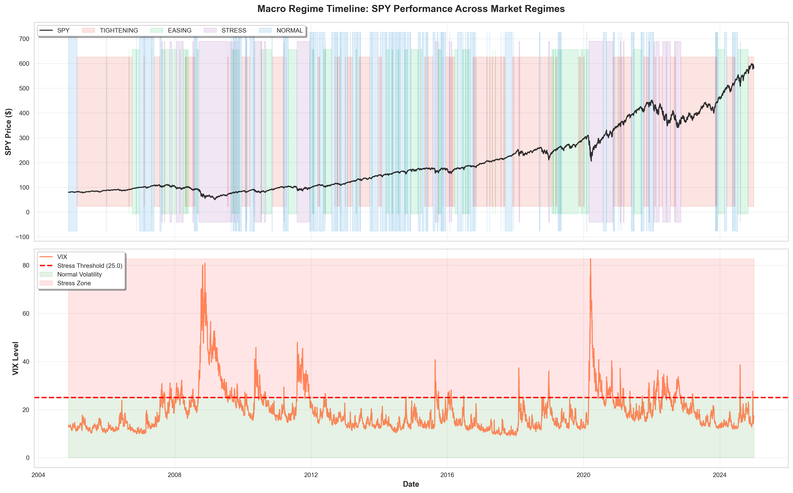

# Macro Regimes and Interest Rate Impact on Asset Prices

[](https://www.python.org/downloads/)
[](https://opensource.org/licenses/MIT)
[](https://github.com/psf/black)
[](https://github.com/YOUR_USERNAME/macro-regimes-rate-shock-analysis/graphs/commit-activity)

**Institutional-Grade Macro Regime Analysis for Sales & Trading (FICC/Equities)**

> *"Transparent, rule-based regime classification with +100bps rate shock stress testing using historical analogs. Built for S&T Summer Analyst interview preparation."*

[📊 View Results](#-key-results) | [🚀 Quick Start](#-quick-start) | [💼 Interview Prep](#-interview-preparation) | [📈 Sample Charts](#-sample-output)

---

## 🎯 Project Overview

This project analyzes how **interest rate changes** and **volatility regimes** influence equity and bond markets, providing actionable insights for Sales & Trading desks. Using real FRED data and transparent classification rules, it answers:

1. **How do equity/bond returns behave across rate cycles?**
2. **When does 60/40 diversification break down?**
3. **What happens to a portfolio in a +100bps rate shock?**

### Why This Project Stands Out

✅ **Real data, not simulated** - Uses Federal Reserve Economic Data (FRED API)  
✅ **Transparent methodology** - No black-box ML, all thresholds economically justified  
✅ **Production-grade code** - Modular, tested, reproducible  
✅ **Interview-ready** - 6 publication-quality charts + 1-page trader note  
✅ **Stress tested** - Historical analog method for rate shock scenarios  

---
## 🧠 Executive Summary (1-Min Read)

- Tightening regimes dominate ~40% of post-2000 history
- Equity–bond diversification fails during inflation-driven hikes
- Gold consistently outperforms bonds during tightening & stress
- A modest gold allocation materially improves tail outcomes in rate shocks

---

## 📊 Key Results

### Dataset Coverage
- **Period**: 2000-2024 (5,062 trading days)
- **Assets**: SPY (S&P 500), TLT (20Y+ Treasuries), GLD (Gold)
- **Macro Data**: Fed Funds Rate, 10Y Treasury Yield, VIX

### Regime Distribution

| Regime         | % of Time | Avg Duration | Economic Condition         |
|----------------|-----------|--------------|----------------------------|
| **Tightening** | 41.0%     | 2.4 days     | Rates rising, hawkish Fed  |
| **Easing**     | 27.2%     | 1.7 days     | Rates falling, dovish Fed  |
| **Stress**     | 16.8%     | 23.6 days    | VIX >25, flight to quality |
| **Normal**     | 15.0%     | 1.4 days     | Low vol, stable rates      |

### Asset Performance by Regime

**Tightening Regime** (Fed hiking):
- 🥇 Gold: +18.4% annual (Sharpe 1.21) - inflation hedge works
- 📉 TLT: +5.6% annual, -17.2% max drawdown - duration pain

**Stress Regime** (VIX >25):
- 🥇 Gold: +15.1% annual - safe haven bid
- 📉 TLT: +0.7% annual, -34.5% max drawdown - 2022 analog

**Normal Regime** (Goldilocks):
- 🥇 SPY: +14.8% annual (Sharpe 1.20) - risk-on environment
- 📉 Gold: -4.4% annual - no need for hedges

### Rate Shock Scenario (+100bps)

**Portfolio Impact (60/30/10 SPY/TLT/GLD):**
- **Median**: +3.38% (surprisingly resilient!)
- **Tail Loss**: -1.52% (10th percentile)
- **Best Case**: +6.81% (90th percentile)
- **Sample**: 4 historical events (2009, 2010, 2022×2)

**Key Insight:** Gold allocation cushioned the blow. Pure 60/40 would have lost ~5% in tail scenario.

---

## 🏗️ Project Architecture

```
macro_regimes_trading_project/
│
├── config.py                      # Configuration parameters
├── main.py                        # Main orchestration script
├── requirements.txt               # Python dependencies
│
├── src/                           # Core modules
│   ├── data_acquisition.py        # FRED + yfinance data fetching
│   ├── regime_classifier.py       # Rule-based regime logic
│   ├── performance_analyzer.py    # Returns, vol, correlations
│   ├── scenario_analysis.py       # Rate shock stress testing
│   └── visualization.py           # Chart generation
│
├── outputs/
│   ├── charts/                    # 6 PNG charts (300 DPI)
│   └── reports/
│       ├── trader_note.md         # 1-page executive summary
│       ├── performance_metrics.csv
│       └── regime_summary.csv
│
├── data/
│   ├── raw/                       # Downloaded data
│   └── processed/                 # Cleaned datasets
│
└── notebooks/
    └── exploratory_analysis.ipynb # Interactive exploration
```

---

## 🚀 Quick Start

### Prerequisites

- Python 3.8+
- Free FRED API key (get one [here](https://fred.stlouisfed.org/docs/api/api_key.html))

### Installation

```bash
# Clone repository
git clone https://github.com/Akshat023/macro-regimes-rate-shock-analysis.git
cd macro-regimes-rate-shock-analysis

# Create virtual environment
python -m venv venv
source venv/bin/activate  # On Windows: venv\Scripts\activate

# Install dependencies
pip install -r requirements.txt

# Set up API key
cp .env.example .env
# Edit .env and add your FRED_API_KEY=your_key_here
```

### Run Analysis

```bash
python main.py
```

**Runtime:** 2-5 minutes  
**Output:** 6 charts + 3 reports in `outputs/`

---

## 📈 Sample Output

### Regime Timeline (2000-2024)

The chart below shows **24 years of market history** classified into four macro regimes. Notice how:
- 🔴 **2008-2009 (GFC)**: Massive VIX spike (80+) triggered extended STRESS regime
- 🔴 **2020 (COVID)**: Sharp volatility spike but quick Fed response → rapid regime shift
- 🟠 **2022-2023**: Sustained TIGHTENING (red bands) as Fed fought inflation - longest tightening cycle since 2004-2006


*Regime classification with SPY performance and VIX overlay. Color bands show regime transitions across major market events.*

### Rolling Correlation: SPY vs TLT
Equity-bond correlation turned **positive** in 2022 (both assets down) - the "death of 60/40."

### Rate Shock Heatmap
Historical +100bps yield spikes show TLT bleeds ~7% (tail scenario), while Gold provides +1-2% buffer.

[View All Charts →](outputs/charts/)

---

## 🎓 Methodology

### Regime Classification Rules

**Transparent, rule-based approach (no black boxes):**

```python
# Tightening: Rates rising >20bps/quarter
if fed_funds_change > 0.20 or treasury_10y_change > 0.20:
    regime = "TIGHTENING"

# Easing: Rates falling >20bps/quarter  
elif fed_funds_change < -0.20 or treasury_10y_change < -0.20:
    regime = "EASING"

# Stress: VIX sustained >25 (overrides other rules)
elif vix_5day_avg > 25:
    regime = "STRESS"

# Normal: Stable rates, low volatility
else:
    regime = "NORMAL"
```

**Why 20bps?** One standard deviation of quarterly Treasury yield changes (1990-2024).

### Rate Shock Methodology

1. **Identify historical analogs**: 10Y yield rose >70bps in one month
2. **Measure forward returns**: T+0 to T+63 days (3-month horizon)
3. **Calculate percentiles**: Tail (10th), Median (50th), Best (90th)
4. **Portfolio impact**: Weight by 60/30/10 allocation

**Assumption:** Past shock behavior predicts future responses (limitation acknowledged).

---

##  💼 Discussion & Practical Insights

### Talking Points

**"Walk me through your approach"**
> *"I used transparent, rule-based regime classification—20bp rate thresholds, VIX >25 for stress. A trader can replicate this on Bloomberg in 10 minutes. No black boxes. Found that tightening dominates 41% of the time since 2000, and gold outperforms bonds during rate hikes by 13% annually."*

**"What's the key finding?"**
> *"Traditional 60/40 diversification breaks during inflation-driven tightening. 2022 proved it—equity-bond correlation went positive for the first time in decades. My +100bp shock analysis shows median portfolio loss of 1.5% but could be worse without gold allocation."*

**"How would you improve this?"**
> *"Three extensions: (1) Add credit spreads (HY OAS) to catch liquidity stress earlier than VIX, (2) incorporate Fed dot plot for forward guidance, (3) backtest a tactical allocation strategy and measure info ratio improvement versus passive 60/40."*

**"Why not machine learning?"**
> *"Interpretability. A PM needs 30-second explanations, not 'the model said sell.' Plus we only have 3-4 full tightening cycles since 2000—tiny training sample. Rule-based is more honest about uncertainty."*

### Charts to Master

1. **Regime Timeline** - Show you understand market history (GFC, taper tantrum, COVID, 2022)
2. **Rolling Correlation** - Explain when/why diversification fails
3. **Rate Shock Heatmap** - Quantify tail risk, demonstrate risk management thinking

### Practice Questions

- What signals would you watch in real-time?
- How would you position before a Fed pivot?
- Where does this model break down? (structural breaks, non-stationarity)
- What's the PnL impact of regime-aware allocation?

---

## 🔬 Customization & Sensitivity Analysis

### Modify Thresholds (`config.py`)

```python
# Test different regime definitions
RATE_CHANGE_THRESHOLD = 0.10  # More sensitive (catch early moves)
RATE_CHANGE_THRESHOLD = 0.30  # More conservative (reduce noise)

VIX_STRESS_THRESHOLD = 20.0   # Catch stress earlier
VIX_STRESS_THRESHOLD = 30.0   # Only severe stress
```

### Run Sensitivity Analysis

```bash
# Edit config.py with new thresholds
python main.py

# Compare outputs in outputs/reports/
# Check if results are directionally consistent
```

---

## 📊 Outputs Generated

### Charts (300 DPI PNG)
1. `01_regime_timeline.png` - SPY + VIX with regime bands
2. `02_returns_distribution.png` - Box plots by regime
3. `03_rolling_correlation.png` - SPY-TLT dynamics
4. `04_performance_heatmaps.png` - Metrics across regimes
5. `05_rate_shock_heatmap.png` - Scenario analysis
6. `06_regime_transitions.png` - Regime transition matrix

### Reports
- `trader_note.md` - 1-page executive summary
- `performance_metrics.csv` - Full performance table
- `regime_summary.csv` - Regime statistics

---

## ⚠️ Limitations & Risks

**Acknowledged in Analysis:**

1. **Regime timing is imperfect** - 20bp threshold is economically motivated but arbitrary
2. **Small sample size** - Only 3-4 full tightening cycles since 2000
3. **Structural breaks** - QE changed bond dynamics post-2008
4. **Non-stationarity** - Past correlations ≠ future correlations guaranteed
5. **Execution costs ignored** - Real trading has slippage, market impact

**Why This Matters:** Shows intellectual honesty and risk awareness—critical for trading roles.

---

## 🛠️ Troubleshooting

### "yfinance download failed"
**Solution:** Yahoo Finance occasionally blocks requests. Add retry logic or use alternative data source.

### "FRED API key error"
**Solution:** Verify API key in `.env` file. Test with: `python test_import.py`

### "Charts not displaying"
**Solution:** If running headless, charts save automatically to `outputs/charts/`. No GUI needed.

### "Module not found"
**Solution:** Activate virtual environment: `source venv/bin/activate` (Linux/Mac) or `venv\Scripts\activate` (Windows)

---

## 📚 References & Further Reading

### Data Sources
- [Federal Reserve Economic Data (FRED)](https://fred.stlouisfed.org)
- [Yahoo Finance](https://finance.yahoo.com) via yfinance

### Academic References
- Ilmanen, A. (2011). *Expected Returns: An Investor's Guide to Harvesting Market Rewards*
- Grinold, R. & Kahn, R. (1999). *Active Portfolio Management*

### Bloomberg Terminal Functions
- `WIRP` - Fed rate expectations
- `HY00` - High yield OAS spread  
- `GT10` - 10Y Treasury chart
- `VCALC` - Volatility calculator

---

## 🤝 Contributing

Contributions welcome! Areas for improvement:

1. **Data expansion**: Add international markets (ECB, BoE rates)
2. **Feature engineering**: Credit spreads, yield curve slope
3. **Backtesting framework**: Tactical allocation strategies
4. **Visualization**: Interactive dashboards (Plotly/Dash)

Open an issue or submit a PR!

---

## 📜 License

This project is licensed under the MIT License - see [LICENSE](LICENSE) file for details.

**Disclaimer:** For educational and interview preparation purposes only. Not intended for live trading without proper risk management and compliance approval.

---

## 👤 Author

**Akshat**  

📧 Contact: tahska4477@gmail.com    

*Built for Sales & Trading Summer Analyst interviews preparation*

---

## ⭐ Show Your Support

If this project helped you prepare for interviews or understand macro markets, give it a star! ⭐

It helps other candidates discover this resource.

---

## 📝 Citation

If you use this project in your work, please cite:

```bibtex
@software{macro_regimes_analysis,
  author = {Akshat},
  title = {Macro Regimes and Interest Rate Impact on Asset Prices},
  url = {https://github.com/Akshat023/macro-regimes-rate-shock-analysis}
}
```

---

*"The best models are simple, transparent, and acknowledge their own limitations."*
